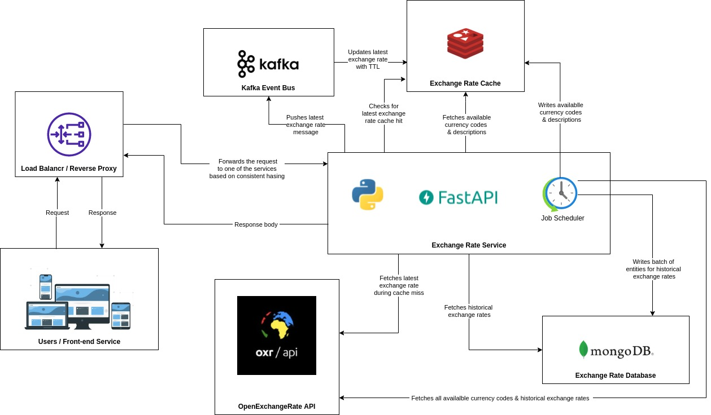

# ExchangeRate
A service that gives the latest and historical exchange rate for the currency.

### Boilerplate Code
The boilerplate code for this project was generated via [manage-fastapi](https://github.com/ycd/manage-fastapi)!

### Docs and Demo
For docs, click [here](https://j9j5kn.deta.dev/docs).
 To see the demo of the deployed version, click [here](https://j9j5kn.deta.dev/currencies/).

### Suggested Architecture

### TODOS:
* Unit Tests and API Integration Tests
* Loggers
* Cron job scheduler for the suggested architecture
* Database & caching layer for the suggested architecture

### License

This project is licensed under the terms of the Apache license.
